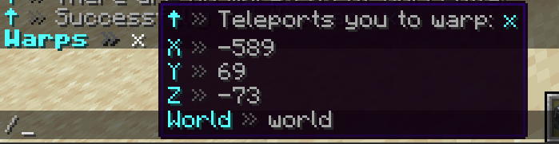

# 🚩 Warps

Warps are a lot less complicated than other features in AdvancedTeleport and have relatively straightforward features. It is enabled by the `use-warps` option in the config.yml file.

```yaml
use-warps: true
```

## Commands

The following commands fall under the warps feature branch:

* [`/delwarp`](../commands/admin-commands.md#delwarp)
* [`/movewarp`](../commands/admin-commands.md#movewarp)
* [`/setwarp`](../commands/admin-commands.md#setwarp)
* [`/warp`](../commands/member-commands.md#warp)
* [`/warps`](../commands/member-commands.md#warps)

## Warp Usage

Server administrators can start by setting a new warp using [`/setwarp`](../commands/admin-commands.md#setwarp). They are able to use characters of any combination or length. From there, players can access it using [`/warp`](../commands/member-commands.md#warp), assuming they have permission to access it (`at.member.warp.<warp>`). However, by default, all players can access all warps.

If an admin wants to delete a warp, they can use  [`/delwarp`](../commands/admin-commands.md#delwarp). If they want to change the warp's location, they can just use [`/movewarp`](../commands/admin-commands.md#movewarp).

If a player does [`/warps`](../commands/member-commands.md#warps) to view the existing set of warps that they have access to, the plugin can do one of the three things:

1. Tell the player that there are no warps. This is the case if no warps have been set, or if the player does not have access to any existing warps. Warps that players cannot access are hidden from view.
2.  Send a list of warps available to the player as a text message. Players can hover over individual warp names, and click on them to teleport to the warp without having to type `/warp <warp>`.\
    \
    &#x20;If the player has the permission `at.member.warps.location`, then they will be able to see the location of each warp too.\


    <figure><figcaption></figcaption></figure>
3. Opens a GUI with configured warps appearing.

## Warp GUI

`// TODO`


The Warps GUI is an old feature of AdvancedTeleport, and not quite up to speed with the rest of the plugin. It'll likely get revamped soon.

